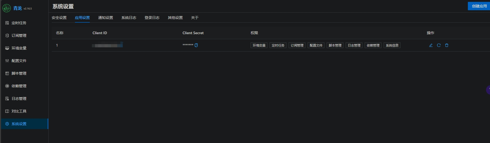
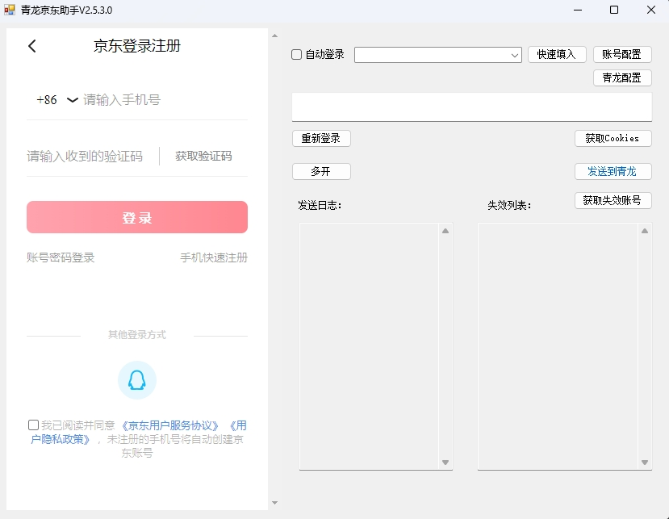

# 青龙京东助手
青龙面板的京东cookie获取工具，配置api应用后可一键发送到青龙面板。
  给小伙伴愉快的使用体验

## 安卓版
[安卓版](https://github.com/yclown/jdck-android)
 
## 功能说明
1. 登录京东,一键发送青龙面板需要的环境变量
2. 配置青龙面板功能，可在应用中直接配置，不用操作配置文件
3. 账号记录功能 
     V2.4.3更新账号编辑页面，旧数据需要点击账号页左下角导入，新增账号备注，以及显示
     
    

## 使用说明
1. 登录京东
2. 点击获取 获取到cookie会在右侧显示
3. 点击发送到青龙面板（如果配置了青龙参数）

下载 [青龙京东助手](https://github.com/yclown/ql_jd_cookie/releases)。
  解压后运行JD_Get.exe程序即可

## 青龙配置说明
QL_URL 青龙面板地址 示例http://ip:5700
**QL_ClientID**和**QL_ClientSecret** 这两个参数由青龙面板创建
  方法如下   
1. 登录青龙面板
2. 系统设置
3. 应用设置
4. 创建应用
5. 权限全部选上
6. 创建好应用后，填写到配置中

## 界面预览

